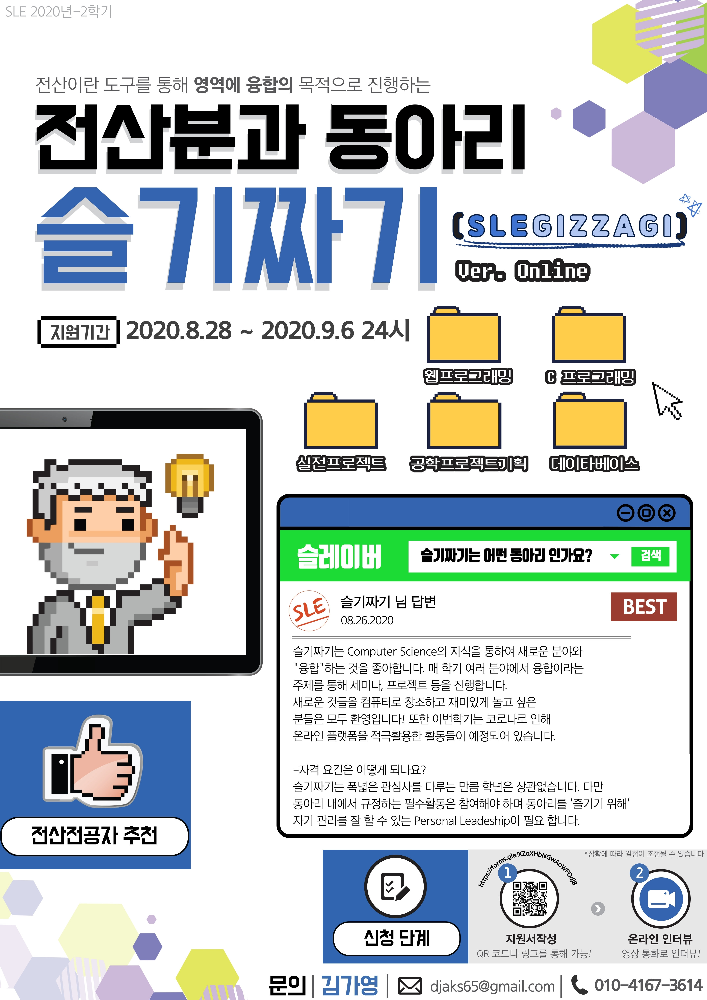

# 20-2 학기 슬기짜기

---

> 안녕하세요 20-2학기 슬기짜기 회장 김가영 입니다. 이번학기도 한번 슬기롭게 짜보죠!

## 슬기짜기란.

*  슬기짜기는 1995년, 학교 개교 이후 기계제어시스템공학부 / 전산전자공학부 학생들이 주축이 되어 만들어졌습니다.

* 슬기짜기는 외래어인 컴퓨터를 순 우리말로 풀어 '슬기셈틀'이라고 합니다. '짜다'는 생각을 구상하고 계획한다는 의미입니다. "슬기 셈틀"과 "짜다"를 합성하여 슬기짜기가 탄생하였습니다.

* 슬기짜기는 Computer Science라는 학문을 중심으로 여러 다른 분야와  **융합**하여 프로젝트를 진행하는 동아리 입니다.

* 슬기짜기 고대 web page (http://people.cs.pitt.edu/~charmgil/old-www/sle/) 
 
  <!-- 곧 새로운 동아리 로고가 나타납니다. 

  
 -->
  
  

## 활동

> * 2020년 2학기 부터는, 슬기짜기에서는 모두가 본인이 원하는 프로젝트에 속해 있어야 합니다. 개인의 활동으로는 프로젝트를 성장 시키고, 단체 활동에서는 그러한 성장을 다른 사람들에게 나눠주는 역할을 하게 됩니다.
>* 다음은 각각, 슬기짜기 일원으로서 개인과 단체에 대한 활동입니다. 

### Sle_Seminar

* 본인들이 관심이 있거나 나누고 싶은 주제에 대해서 대략 10분에 걸쳐서 seminar를 진행합니다.

### Sle_Project

* 방학기간을 이용하여 Project의 주제를 선정하고, 설계하며, 완벽한 개발의 목적이 아닌, 진행 과정 속에서의 배움을 추구하며 프로젝트를 진행합니다.

### Sle_Algorithm

* 매주 정한 두가지 topic의 알고리즘 문제를 풀며 진행합니다.

### Sle_Community

* 가끔식은 잉여짓을 하며, 프로그래머에게 중요한 Social Network를 관리합니다.

### 개인 활동

* 프로젝트에 속하여 설계 및 건설하기.
* 한 학기 최소 1회 세미나 진행
* Sle_Algo 참여

### 단체

* **정모 시간: 화요일 20시-21시(시간은 진행상황에 따라 유동적)**
* MT 및 OT
* 동아리 외식
* 동아리 정모
* 임원 선거
* Optional: 방학 프로젝트

## 20년도 2학기 계획

### 주차 별

| 주차                               | 내용                                  |
| ----------------------------------| ------------------------------------ |
| 1 주차                             | 기존 멤버 설문 조사                       |
| 2 주차                             | OT (Orientation) + Networking, Eat out|
| 3 주차                             | Sle_Community & Recruiting End, Sle_Algo|
| 4 주차                             | Sle_Community, Sle_Algo              |
| 5 주차                             | Sle_Community, Sle_Algo              |
| 6 주차                             | Sle_Community, Sle_Algo              |
| 7 주차                             | Sle_Algo                             |
| 8 주차  | 중간 고사: ~~Week Off~~                |
| 9 주차                             | Project OT + Sle_Algo, Eat out       |
| 10 주차                            | Sle_Seminar + Sle_Community, Sle_Algo|
| 11 주차                            | Sle_Seminar + Sle_Community, Sle_Algo|
| 12 주차                            | Sle_Seminar + Sle_Community, Sle_Algo|
| 13 주차                            | Sle_Seminar + Sle_Community, Sle_Algo|
| 14 주차                            | Sle_Seminar + Sle_Community, Sle_Algo|
| 15 주차                            | ~~Week Off~~                         |
| 16 주차 | 기말 고사: ~~Wee Off~~               |
| 17 주차~                           | Winter Project Start                 |

*일정은 조정될 수 있습니다*

## Recuriting

## 운영 방침

* [동아리회칙](rule.md)

## Contact

* 회장 김가영

  * :phone: 010-4167-3614
  * :email: djaks65@gmail.com
